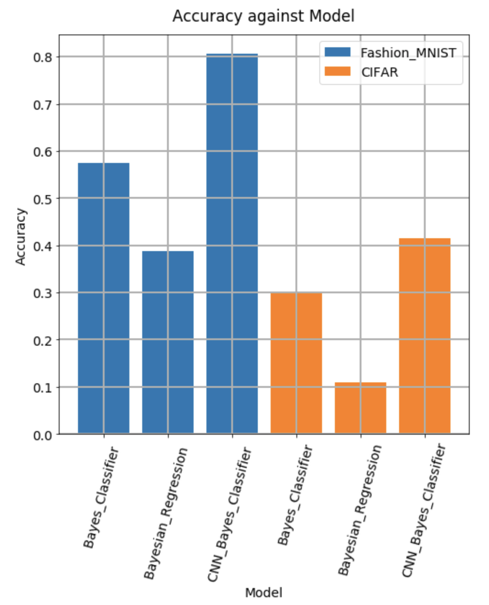

# Advanced Statistical Inference

In this notebook, our main idea is to implement two statistical algorithms: **Naïve Bayes Classifier** and the **Bayesian Linear Regression** in Numpy by hand coding all their formulas; and Then we want to see their baseline performance on two popular images classification dataset: Fashion MNIST and CIFAR10. 

And finally we will perform a interesting experiment that stack our Naïve Bayes Classifier on a trained CNN, to see after using CNN to extract pattern features from images, how much will our result improve.

we can see from the above result:
 * The images' pixels is very hard to fullfill the Gaussian distribution assumption so both two statistical algorithms performance quite poor in image classification.
 * Due to the CIFAR10 is color image, it work worse than MNIST which is black-whiter, since the distribution of each color pixel is more far away from Gaussian distribution.
 * CNN improves both two algorihtm, means the lower CNN layer can help to extract useful pattern features from image.

### NOTE
Since we already know that the Gaussian distribution assumption required in those two models is very hard to be achieved in image classification. Our goal here in this notebook is not to achieve better classification accuracy but: to understand the Statistical Inference behind this two algorithms: how do these two algorithms work if the Gaussian distribution condition is not met in the problem.

so we do not tuning the hyperparameter and just training models for several epochs to save time.

